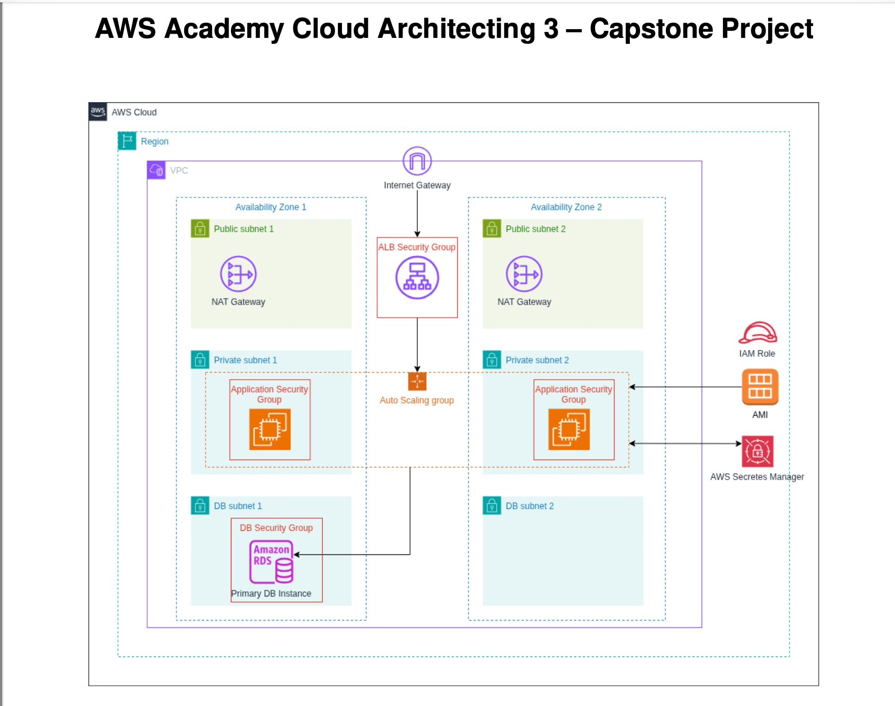
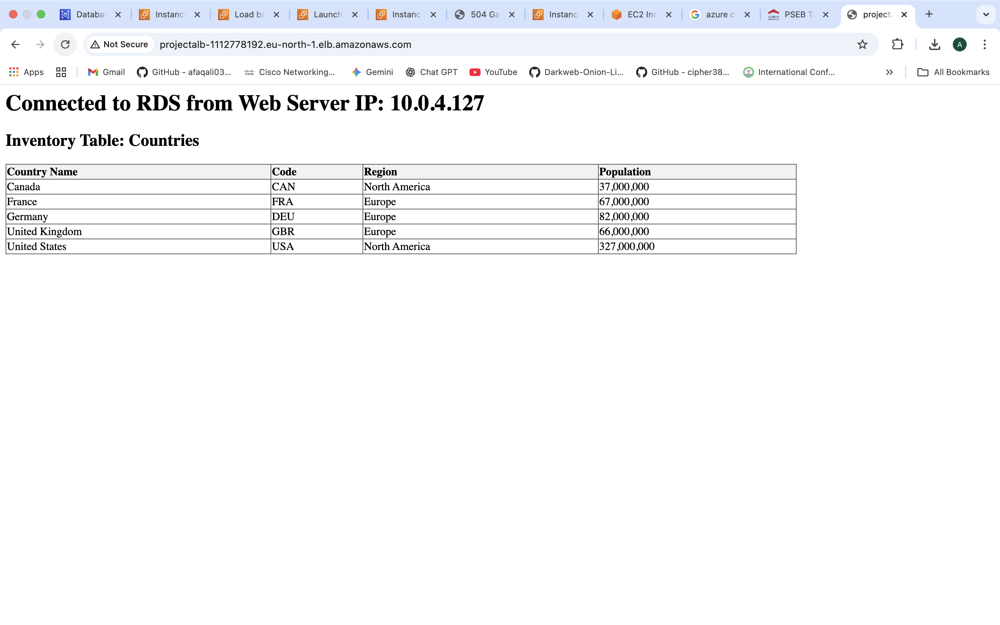

# 🌐 Scalable 3-Tier Cloud Architecture: Inventory Management System

[](https://aws.amazon.com/)
[](https://www.php.net/)
[](https://www.mysql.com/)
[](https://www.linux.org/)


## 📖 Executive Summary
Successfully engineered and deployed a **High-Availability (HA) 3-Tier Web Application** on AWS. This project demonstrates a transition from a monolithic setup to a distributed, secure architecture, isolating application and database layers within private subnets while maintaining public accessibility via an Elastic Load Balancer.

### 🚀 Key Technical Achievements
* **Infrastructure Isolation:** Engineered a custom VPC with Public and Private subnets to enforce a "Security-by-Design" posture.
* **Automated Scaling:** Implemented an Auto Scaling Group (ASG) with a Target Tracking policy to handle dynamic traffic loads seamlessly.
* **MySQL 8.4 Integration:** Diagnosed and resolved the `mysql_native_password` deprecation issue, ensuring legacy PHP compatibility with modern RDS security standards.
* **Secrets Orchestration:** Integrated AWS Secrets Manager for programmatic credential retrieval, eliminating hardcoded sensitive data.

---

## 🏗 System Architecture


The architecture is strategically divided into three distinct layers:
1.  **Web/Presentation Layer:** Application Load Balancer (ALB) acting as the managed entry point for external traffic.
2.  **Application/Logic Layer:** EC2 fleet (Amazon Linux 2023) running Apache/PHP within Private Subnets.
3.  **Data/Persistence Layer:** Amazon RDS (MySQL) isolated in a dedicated Database Subnet Group.



---
## 🚀 Deployment Workflow

1. Create custom **VPC with public and private subnets**
2. Configure **Internet Gateway and NAT Gateway**
3. Deploy **Amazon RDS MySQL instance**
4. Store database credentials in **AWS Secrets Manager**
5. Create **Launch Template with User Data script**
6. Configure **Auto Scaling Group**
7. Deploy **Application Load Balancer**
8. Attach ASG to **Target Group**
9. Verify load balancing across instances

---

## ⚙️ Configuration Details

### **Network Topology**
| Resource | Specification |
| :--- | :--- |
| **VPC CIDR** | `10.0.0.0/16` |
| **Availability Zones** | `eu-north-1a`, `eu-north-1b` |
| **Subnet Strategy** | 2 Public (ALB/NAT), 2 Private (App), 2 Private (DB) |
| **Internet Access** | NAT Gateway in Public Subnet for Private Instance egress |

### **Security Matrix (Least Privilege)**

| Security Group | Inbound Rule | Protocol/Port | Source |
| :--- | :--- | :--- | :--- |
| **ALB-SG** | Allow HTTP | TCP/80 | `0.0.0.0/0` |
| **App-SG** | Allow HTTP | TCP/80 | `ALB-SG` |
| **DB-SG** | Allow MySQL | TCP/3306 | `App-SG` |

---

## 💻 Code & Automation

### **Infrastructure Bootstrapping (User Data Script)**
This script automates the entire instance lifecycle, from package installation to database seeding.

```bash
#!/bin/bash
# ---------------------------------------------------------------------
# Bootstrap Script for Inventory App
# ---------------------------------------------------------------------

# 1. Update and Install Stack
dnf update -y
dnf install -y httpd php php-mysqli php-json mariadb105 jq
systemctl start httpd
systemctl enable httpd

# 2. Programmatic Secret Retrieval
ENDPOINT="countries.c368u2kk215h.eu-north-1.rds.amazonaws.com"
SECRET_ARN="arn:aws:secretsmanager:eu-north-1:068406408985:secret:rds!..."
DB_PASS=$(aws secretsmanager get-secret-value --secret-id $SECRET_ARN --region eu-north-1 --query SecretString --output text | jq -r '.password')

# 3. Database Hardening & Schema Seeding
mysql -h $ENDPOINT -u admin -p"$DB_PASS" <<MYSQL_SCRIPT
CREATE DATABASE IF NOT EXISTS countries;
ALTER USER 'admin' IDENTIFIED WITH mysql_native_password BY '$DB_PASS';
USE countries;
CREATE TABLE IF NOT EXISTS country (
    Code CHAR(3) PRIMARY KEY,
    Name CHAR(52) NOT NULL,
    Region CHAR(26) NOT NULL,
    Population INT(11) NOT NULL
);
REPLACE INTO country (Code, Name, Region, Population) VALUES 
('USA','United States','North America',327000000),
('FRA','France','Europe',67000000),
('DEU','Germany','Europe',82000000);
MYSQL_SCRIPT
```

---
## **👨‍💻 Application Logic (`index.php`)**
The application layer is engineered with PHP to dynamically pull database connection details and render a formatted inventory table. It includes server-side logic to display the **Production Node IP**, verifying the Load Balancer’s traffic distribution across the private fleet.

```php
<?php
// Establish connection to RDS Backend
$conn = new mysqli($host, $user, $pass, "countries");

if ($conn->connect_error) {
    die("<h3>Database Connection Error: 500</h3>");
}

echo "<h1>Production Node IP: " . $_SERVER['SERVER_ADDR'] . "</h1>";

// Query to retrieve inventory data
$result = $conn->query("SELECT Name, Code, Population FROM country ORDER BY Population DESC");

if ($result) {
    echo "<table border='1' cellpadding='10'>";
    echo "<tr><th>Country</th><th>Code</th><th>Population</th></tr>";
    while($row = $result->fetch_assoc()) {
        echo "<tr>
                <td>{$row['Name']}</td>
                <td>{$row['Code']}</td>
                <td>" . number_format($row['Population']) . "</td>
              </tr>";
    }
    echo "</table>";
}
?>
```
---
## **🔍 Technical Troubleshooting Case Study**
**The Challenge:** Initial deployment resulted in persistent HTTP 500 errors and "Unknown Database" exceptions.

**Diagnostic Workflow:**

**Log Analysis:** Performed deep-dive investigation of /var/log/cloud-init-output.log via SSH.

**Identification:** Discovered that external SQL assets were unreachable (404) and MySQL 8.4's default authentication plugin (caching_sha2_password) was incompatible with the PHP mysqli extension.

**Resolution Implementation:**

**Local Seeding:** Implemented SQL injection directly within the User Data script to eliminate reliance on external 404-prone assets.

**Legacy Auth Bridge:** Executed ALTER USER...IDENTIFIED WITH mysql_native_password to restore PHP-to-MySQL handshake compatibility.

**Grace Period Optimization:** Adjusted the Health Check Grace Period to 300s to allow the database seeding to complete before the Load Balancer evaluated instance health.

---
## **📈 Final Deployment Proof**
**🧹 Maintenance & Teardown**
To ensure cost-efficiency and adhere to cloud financial best practices, all billable resources were decommissioned post-verification:

**Networking:** Deletion of NAT Gateways and release of associated Elastic IPs.

**Persistence:** Termination of the RDS Multi-AZ instance.

**Compute:** Removal of the Application Load Balancer (ALB) and Auto Scaling Group (ASG).




---
## 🧠 Skills Demonstrated

- AWS VPC Architecture
- High Availability Infrastructure
- Application Load Balancer
- Auto Scaling
- Amazon RDS
- Secrets Manager
- Infrastructure Bootstrapping
- Linux System Administration
- PHP + MySQL Integration
- Cloud Troubleshooting

---
## 👨‍💻 Author

**Afaq Ali**

Aspiring Cloud Engineer  
HCIA-Datacom | AWS Cloud | Oracle | CEH

📍 Islamabad, Pakistan

LinkedIn: https://linkedin.com/in/afaq-a1i
